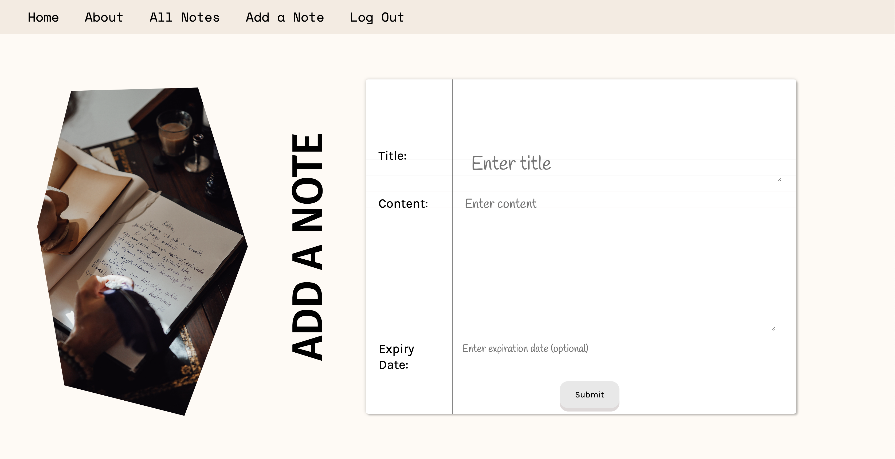

# ReadIt
### Description :
Welcome to ReadIt, where the art of note-taking meets the ease of organization, creating a symphony of productivity for your daily life. Our app is designed with simplicity and versatility in mind, offering a seamless platform to capture and organize your thoughts effortlessly.

## [Try ReadIt here](https://readit.fly.dev/)
## [Planning Material](https://trello.com/b/d2BMfOBF/readit)

### Features:
-  Effortless Navigation:
Our app is designed for intuitive navigation. Easily switch between different modes—text or audio—with a simple tap. 
-  Serenade Your Thoughts:
ReadIt goes beyond the conventional by allowing you to not only jot down your notes but also transform them into a captivating audio experience.
-  Organize with Ease:
Tired of searching through countless notes? ReadIt gives you an option to set an expiration date to auto-delete your notes. Decluttering you notes has never been easier!

### Screenshots

## Tools and Technologies :

## Attributions:
[Django-gTTS](https://pypi.org/project/Django-Gtts/)  
[Notebook animation](https://codepen.io/oliviale/pen/bLYQQE), [Link hover effects](https://www.sliderrevolution.com/resources/css-link-hover-effects/), [Button effect](https://uiverse.io/aasisodiya/nasty-cat-19)  
[Stock photos](https://www.pexels.com/)

## Next Steps:
- Make the app mobile-responsive.
- Add create a collection feature
- More forms to store notes e.g. sticky notes
- Get data from a web page and generate audio
